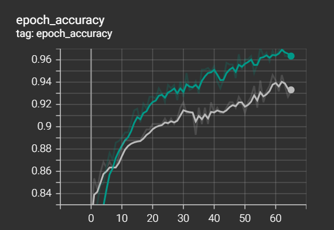
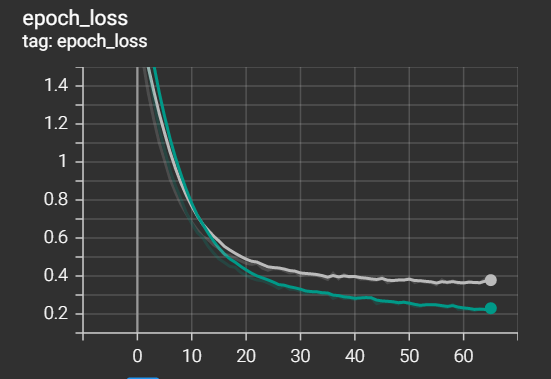
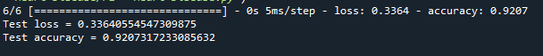

# Heart Disease Prediction with FeedForward Neural Network

## 1. Summary
The objective of this project is to predict whether a patient have a heart disease or not.

## 2. Approach 
### Dataset 
Data link: https://www.kaggle.com/datasets/johnsmith88/heart-disease-dataset.

The data was loaded and preprocessed. There was no missing values and all of the categorical features are already in the correct format 
It is then split for train-validation-test at a ratio of 60:20:20

### Model Summary & Training 
The simple Neural Network below is made for classification problem. 

Batch size of 32 and epoch of 100 is used to train the model. Early stopping is applied during the training to prevent overfitting. L2 regularization and dropout layers are also implemented to counter the overfitting of the model. The training stopped at epoch 66 with the train_accuracy and validation_accuracy of 96% and 93% respectively. Training graph is shown below 
  

## 3. Results

