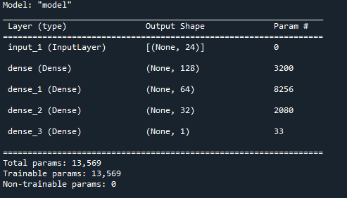
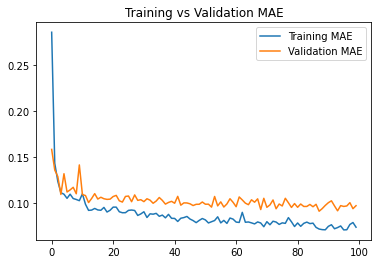
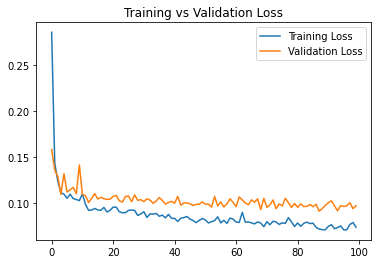
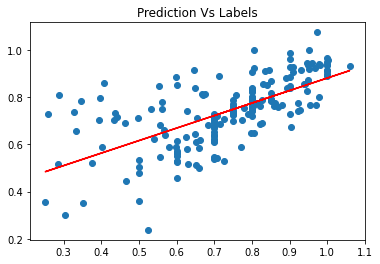

# Predicting Garment Worker Productivity (Regression)
## Summary

Objective: Predict Productivity of workers. 

## Data Preparation

Data Link: https://archive.ics.uci.edu/ml/datasets/Productivity+Prediction+of+Garment+Employees

Dataset undergoes preprocessing. Some data are converted into categorical values by using pandas's get_dummy method. Data Imputation (mean) is applied for missing values under the column 'wip'. 

It is then split into train-validation-test set at the ratio of 60:20:20

## Model Summary
The Neural Network below is made for Regression. 

## Training 
Training with a batch size of 32 and epochs of 100 is done. Training Loss and MAE is shown in the graph below

## Result 

It can be seen that this model is not really the best model to achieve the objective. Another method that can be used to attain the objective is by using classification. This said method can be achieved my transforming the Labels into multiple categories and change the model accordingly. 

