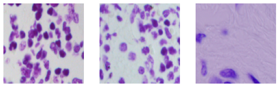
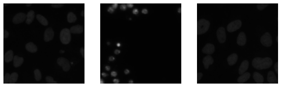
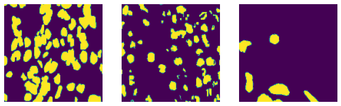
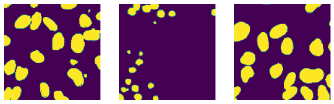
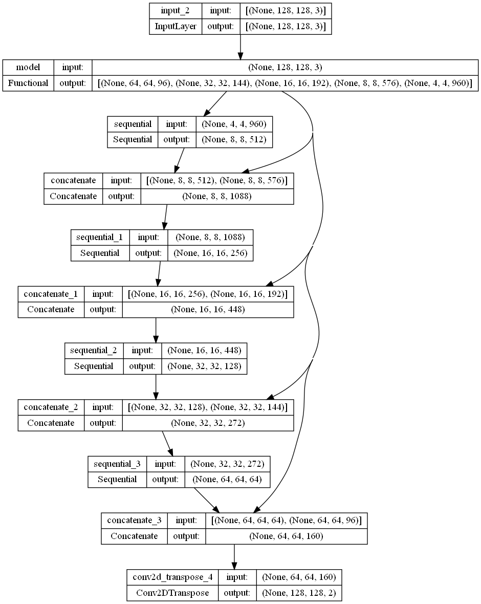
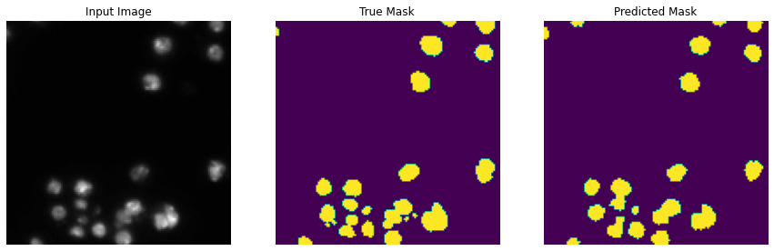
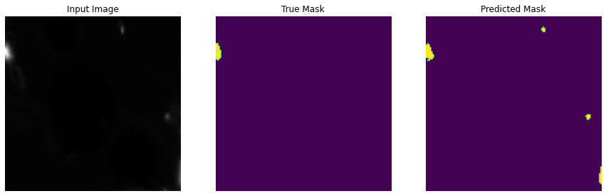
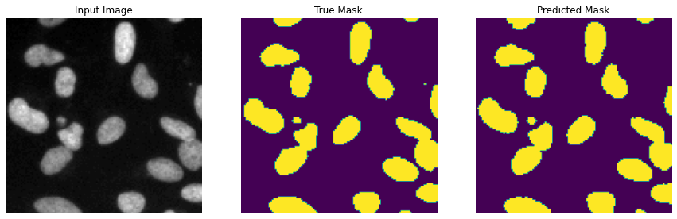

# Nuclei Image Segmentation (U-Net)

## Summary 

Creating a semantic segmentation model that detects nuclei in images

## Dataset 

Link: [Nuclei Semantic Segmentation Dataset](https://www.kaggle.com/competitions/data-science-bowl-2018/overview)

Dataset are loaded and undergoes preprocessing before it can be applied in the U-net semantic segmentation model. preprocessing have the following order.

1. **Images Dataset** --> **Numpy Arrays** --> **Normalization** --> **Tensor** --> **Prefetch**

2. **Masks Dataset** --> **Numpy Arrays** --> **Dimension Expansion** --> **Mask Labels** --> **Tensor** --> **Prefetch**

Below are some examples of images and masks dataset
1. Images Example

 

2. Masks Example

 

## U-Net Model Summary 

## Before Model Training

As you can see from the image below, the model did not do a very good job in predicting the masks of the images 

## After Model Training

The model was trained for 19 epoch which resulted in the accuracy of 96.96%  with the loss of 7.45 percent

From the predictions made above for each image, it can be seen that the model successfully do semantic segmentation of Nuclei in the image. 

